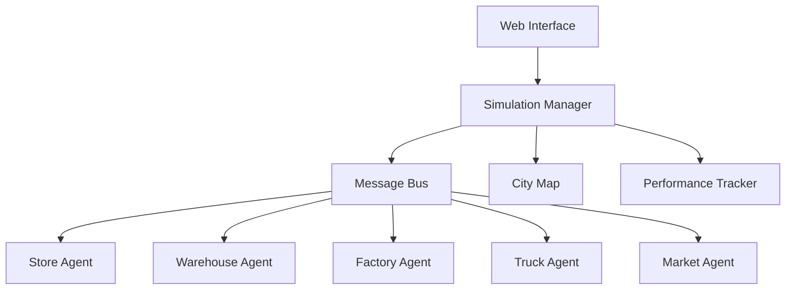

# Design Document

## Overview

Agora is a multi-agent supply chain simulator built with Python, designed as a hackathon prototype. The system uses a simple event-driven architecture where agents communicate through a central message bus. The simulation runs in discrete time steps, making it easy to visualize and debug. The design prioritizes simplicity and clear separation of concerns over complex optimization algorithms.

## Architecture

### High-Level Architecture



### Core Components

1. **Simulation Manager**: Orchestrates the simulation, manages time steps, and coordinates agent actions
2. **Message Bus**: Handles communication between agents using a simple publish-subscribe pattern
3. **City Map**: Represents locations (factories, warehouses, stores) and distances between them
4. **Agent System**: Individual agent classes with their own logic and state
5. **Web Interface**: Simple HTML/JavaScript frontend for visualization
6. **Performance Tracker**: Collects and displays simulation metrics

## Components and Interfaces

### Base Agent Interface

```python
class BaseAgent:
    def __init__(self, agent_id, location, message_bus):
        self.agent_id = agent_id
        self.location = location
        self.message_bus = message_bus
    
    def step(self):
        """Execute one simulation step"""
        pass
    
    def handle_message(self, message):
        """Process incoming messages"""
        pass
    
    def send_message(self, recipient, message_type, data):
        """Send message to another agent"""
        pass
```

### Message Format

```python
class Message:
    def __init__(self, sender, recipient, message_type, data, timestamp):
        self.sender = sender
        self.recipient = recipient
        self.message_type = message_type
        self.data = data
        self.timestamp = timestamp
```

### Agent Specifications

#### Store Agent
- **State**: inventory levels, demand rate, order history
- **Behaviors**: monitor inventory, place orders, serve customers
- **Messages Sent**: ORDER_REQUEST to warehouse
- **Messages Received**: DELIVERY_NOTIFICATION, DEMAND_UPDATE

#### Warehouse Agent  
- **State**: inventory levels, pending orders, truck assignments
- **Behaviors**: process orders, manage inventory, dispatch trucks
- **Messages Sent**: DISPATCH_TRUCK, FACTORY_ORDER
- **Messages Received**: ORDER_REQUEST, DELIVERY_COMPLETE

#### Factory Agent
- **State**: production queue, production capacity, inventory
- **Behaviors**: process production orders, manage production schedule
- **Messages Sent**: PRODUCTION_COMPLETE
- **Messages Received**: FACTORY_ORDER

#### Truck Agent
- **State**: current location, cargo, destination, availability
- **Behaviors**: move between locations, load/unload cargo
- **Messages Sent**: DELIVERY_COMPLETE, PICKUP_COMPLETE
- **Messages Received**: DISPATCH_ORDER

#### Market Agent
- **State**: demand patterns, event schedule
- **Behaviors**: generate demand changes, simulate market events
- **Messages Sent**: DEMAND_UPDATE
- **Messages Received**: None (autonomous)

## Data Models

### Location
```python
class Location:
    def __init__(self, location_id, name, x, y, location_type):
        self.location_id = location_id
        self.name = name
        self.x = x
        self.y = y
        self.location_type = location_type  # 'factory', 'warehouse', 'store'
```

### Product
```python
class Product:
    def __init__(self, product_id, name, unit_cost, storage_cost):
        self.product_id = product_id
        self.name = name
        self.unit_cost = unit_cost
        self.storage_cost = storage_cost
```

### Order
```python
class Order:
    def __init__(self, order_id, product_id, quantity, requester, timestamp):
        self.order_id = order_id
        self.product_id = product_id
        self.quantity = quantity
        self.requester = requester
        self.timestamp = timestamp
        self.status = 'pending'
```

## Error Handling

### Agent Communication Errors
- **Invalid Recipients**: Log warning and continue simulation
- **Message Queue Overflow**: Implement simple FIFO dropping of oldest messages
- **Agent Failures**: Isolate failed agents and continue with remaining agents

### Simulation Errors
- **Invalid State Transitions**: Reset agent to last valid state
- **Resource Conflicts**: Use simple first-come-first-served resolution
- **Timing Issues**: Use discrete time steps to avoid race conditions

### Data Validation
- **Negative Inventory**: Clamp to zero and log warning
- **Invalid Orders**: Reject and notify sender
- **Location Errors**: Use default locations for invalid coordinates

## Testing Strategy

### Unit Testing
- **Agent Behavior Tests**: Test each agent's decision-making logic in isolation
- **Message Handling Tests**: Verify correct message processing and responses
- **State Management Tests**: Ensure agents maintain valid state transitions

### Integration Testing
- **Multi-Agent Scenarios**: Test simple supply chain flows (order → delivery)
- **Message Bus Testing**: Verify message routing and delivery
- **Simulation Flow Tests**: Test complete simulation cycles

### System Testing
- **End-to-End Scenarios**: Run complete supply chain simulations
- **Performance Testing**: Ensure simulation runs smoothly with multiple agents
- **Visual Testing**: Verify UI updates correctly reflect simulation state

### Test Data
- **Simple Scenarios**: Single store, warehouse, factory setup
- **Multi-Location Tests**: Multiple stores with shared warehouse
- **Demand Variation Tests**: Different demand patterns and spikes

## Implementation Notes

### Technology Stack
- **Backend**: Python 3.8+ with asyncio for agent coordination
- **Frontend**: HTML/CSS/JavaScript with WebSocket for real-time updates
- **Data Storage**: In-memory dictionaries (no database needed for prototype)
- **Visualization**: Simple 2D canvas or SVG-based map display

### Simplification Decisions
- **No Complex Routing**: Use straight-line distances between locations
- **Fixed Production Times**: Simple time delays instead of complex scheduling
- **Basic Demand Patterns**: Simple random variations instead of realistic models
- **Single Product Type**: Focus on coordination rather than product complexity

### Performance Considerations
- **Agent Limits**: Cap at 20-30 total agents for smooth visualization
- **Message Throttling**: Limit messages per time step to prevent flooding
- **Update Frequency**: 1-2 second time steps for good visualization balance